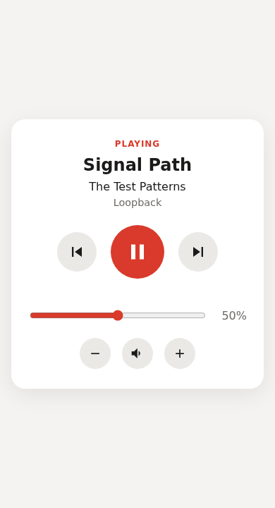

# Remote Music Control

Control YouTube Music playing in a browser on a Windows PC — play/pause, skip,
volume, now-playing — from a web page or a CLI on any other machine on the same
home network.

> **Status:** early development (Phase 3). Play/pause, skip, volume and
> now-playing work from the web page and the CLI, against an in-memory fake
> player. The real Windows adapter comes in Phase 4.

<p align="center">
  
</p>

## Why

The speakers are on the studio PC (Windows 10). The work happens on another PC
(Ubuntu) with only Bluetooth headphones. This project removes the walk between
the two.

## Architecture (planned)

```
 Ubuntu PC / phone                         Windows PC
┌──────────────────┐   HTTP + token   ┌───────────────────────────────────────┐
│ web page  or CLI │ ───────────────▶ │ FastAPI server                        │
└──────────────────┘       LAN        │   └─ MediaController  (port)          │
                                      │        ├─ WindowsMediaController      │
                                      │        │    SMTC (winrt) + pycaw      │
                                      │        └─ FakeMediaController         │
                                      │             in-memory, runs anywhere  │
                                      └───────────────────────────────────────┘
```

The server talks to an abstract `MediaController` interface. The real Windows
implementation and an in-memory fake are interchangeable by configuration, so
everything except one adapter is developed and tested on Linux. See
[ADR 0001](docs/decisions/0001-ports-and-adapters-with-fake-controller.md).

## Repository layout

```
src/remote_music_control/   application package (server, core, adapters, CLI)
  web/                      the web page: index.html, style.css, app.js
tests/                      unit and integration tests (Phase 6)
docs/decisions/             Architecture Decision Records (ADRs)
docs/walkthrough/           block-by-block explanation of the code
```

## Development setup

Requires [uv](https://docs.astral.sh/uv/), which also installs the right Python
version (pinned in `.python-version`).

```bash
git clone git@github.com:GuillermoChagasSartori/remote-music-control.git
cd remote-music-control
uv sync          # creates .venv and installs the locked dependencies
```

Run the server (uses the fake player by default) and talk to it from a second
terminal:

```bash
uv run music-server
uv run music health        # -> server ok — controller: FakeMediaController
```

Open the web page at <http://127.0.0.1:8000/>; interactive API docs are at
<http://127.0.0.1:8000/docs>.

## Usage

### Web page

Open the server's address in any browser. The page refreshes itself every
second while visible, works on phones, and follows the system light/dark
theme. Design rationale: [ADR 0007](docs/decisions/0007-web-client-served-by-server.md).

### CLI

```text
music now              show current track and volume
music play | pause     resume / pause
music toggle           play if paused, pause if playing
music next | prev      skip forward / back
music vol [LEVEL]      show the volume, or set it (0–100)
music up | down [STEP] change the volume by STEP points (default 5)
music mute | unmute
music health           check the server is reachable
```

### HTTP API

| Method & path | Body / query | Response |
|---|---|---|
| `GET /health` | | `{"status": "ok", "controller": "..."}` |
| `GET /api/state` | | track, volume, muted (`null`s if nothing is open) |
| `POST /api/play` · `/pause` · `/play-pause` · `/next` · `/previous` | | `204 No Content` |
| `GET /api/volume` | | `{"volume": 40, "muted": false}` |
| `PUT /api/volume` | `{"level": 40}` | same as above |
| `POST /api/volume/up` · `/api/volume/down` | `?step=5` (optional) | same as above |
| `PUT /api/mute` | `{"muted": true}` | same as above |

Commands answer `409 Conflict` when there is no media session (e.g. the browser
is closed) and `422` for invalid input. Design rationale:
[ADR 0006](docs/decisions/0006-http-api-shape.md).

## Configuration

All settings are environment variables with defaults
([twelve-factor](https://12factor.net/config) style), defined in
`src/remote_music_control/config.py`.

| Variable | Used by | Default | Meaning |
|---|---|---|---|
| `RMC_CONTROLLER` | server | `fake` | Which media adapter to load |
| `RMC_HOST` | server | `127.0.0.1` | Address to listen on |
| `RMC_PORT` | server | `8000` | Port to listen on |
| `RMC_SERVER_URL` | CLI | `http://127.0.0.1:8000` | Where the CLI sends requests (`--url` overrides) |

Install steps for the Windows server will be added as the phases land.

## License

[MIT](LICENSE)
